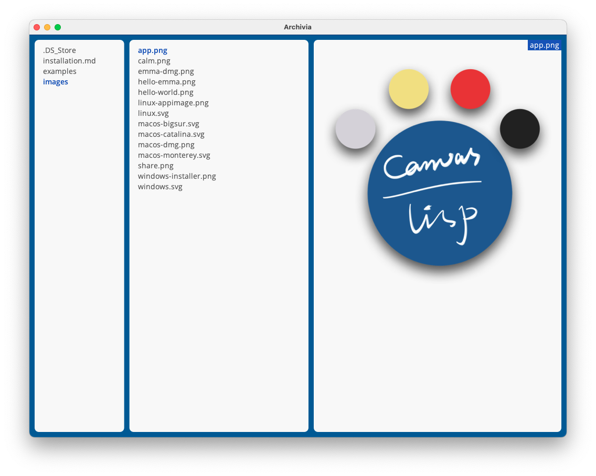
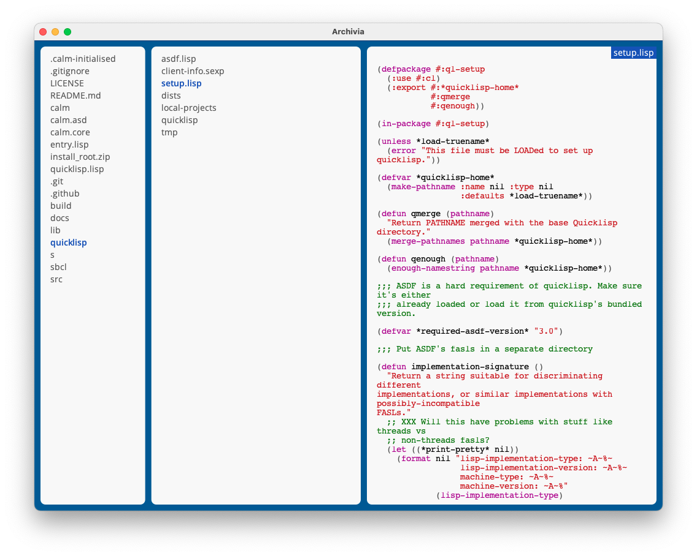
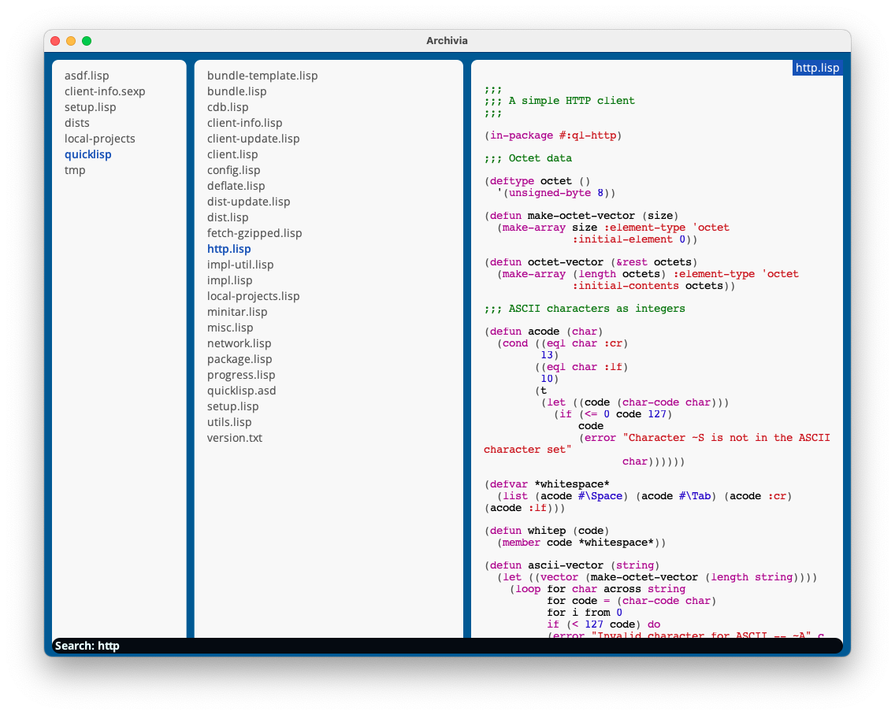

# Archivia
A ranger-inspired file-manager for the GUI

> Currently Archivia was built on an unreleased version of [CALM](https://github.com/VitoVan/calm/pull/110)
>
> Please wait for a while if you wanna give it a try.

